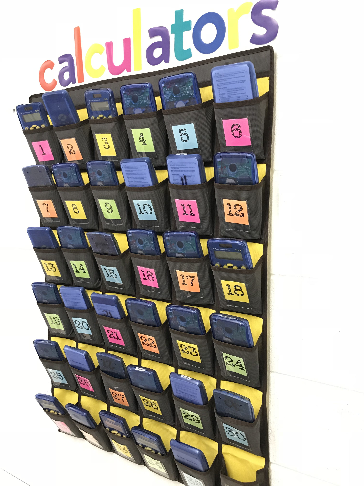

# Arrays in JavaScript Explained, and How to Visualize them

If you’re learning JavaScript, you’ve likely encountered arrays. If you look up what an array is on MDN, you get:

> “The Array object enables storing a collection of multiple items under a single variable name, and has members for performing common array operations.”

If you’re unsure what that means, in this post I’m going to break it down into simpler terms and make it easier to understand and visualize.

As a former math teacher, one way I like to think of arrays is like a calculator holder that you can hang on the wall or door.

Now if you’re wondering what that looks like, I’ve included a picture of one below.

Imagine that this calculator holder pictured above is our array. For now, think of an array as a numbered collection, in this case our array would be the calculator holder.

Each calculator that is in the calculator holder, is an element in our array. If you count them, you will find that we have 35 calculators in that image, so in our example we would have 35 elements in our array.

One important concept for arrays is their length. The length of an array is equal to the number of elements in that array. In our case, the length of our array is 35, because there are 35 calculators in the calculator holder.

    //here is our example
    but written in code

    const calculatorHolder = ['➕','➕','➕','➕','➕','➕','➕','➕','➕','➕','➕','➕','➕','➕','➕','➕','➕','➕','➕','➕','➕','➕','➕','➕','➕','➕','➕','➕','➕','➕','➕','➕','➕','➕','➕']
    //here we have 35 plus signs (denoting the 35 calculators)

    const numOfCalculators = calculatorHolder.length
    //the value for numOfCalculators would be 35

When counting the number of elements in our array, we start counting from the number 1 just like we would normally when counting how many items we have of something.

However, it's different if we’re talking about the index of an element in our array.

An index is a position for a specific element in our array. To find the index of an element, we have to start counting at 0.

That means that if we wanted to find the index of the first element in our array here, which would be the pocket with the sticky note that has a 1 on it, we would type

    //using the same array from the code example above,

    let firstCalculator = calculatorHolder[0]

Where the 0 here represents the index for that first element.

Since our first index here is 0 instead of 1, that means our index for our last element in the array will be one less than the total number of elements.

For our calculator example, remember that we had 35 total calculators. Now if we want to find the index for the last calculator in the calculator holder, it would be 35 - 1, which is 34. To target it in our code, we would write

    let lastElement = calculatorHolder[34]

    //OR could write

    let last Element = calculatorHolder[calculatorHolder.length - 1]

Remember that length here is a built-in property on arrays in JavaScript, which always gives you the total number of elements in your array.

For any other element in our array, the index for that element would be
`the number element it is - 1.` 

If we wanted to target the 4th calculator in our calculator holder here, it would have the index 4 - 1, which equals 3. So we would use index 3 to target it. This equation works for any element in our array.

I hope this article helps you better visualize what an array is in JavaScript. As well as how to find the length or indices for it. Feel free to contact me on <a href="https://twitter.com/LeahTCodes">Twitter</a> if you have any further questions. Thank you for reading!
