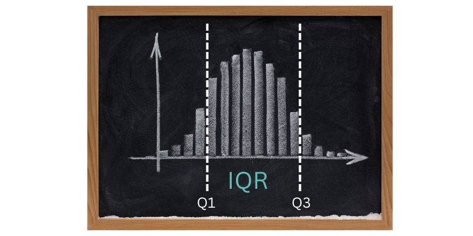

# How to Find Interquartile Range – Calculate IQR

## What is the Interquartile Range ?
Interquartile range is something you might encounter in a Statistics class. Maybe you've seen the term before but didn't know what it was or how to find it. In the following article, I'm going to break it down. 

All you need to know for this tutorial is addition and division.

## What is a Quartile?
To understand interquartile range, first you need to know what a quartile is.

In statistics, a datatset is split into four approximately equal parts, which are known as quartiles. 

In the image of a bar graph below, the far left bars would be the 1st quartile. The middle bars would be Quartile 2 and 3, and the bars to the far right would be Quartile 4.

Interquartile range refers to the middle of your dataset. So both Quartile 2 and Quartile 3 make up your interquartile range.

In the image above,  your interquartile range would be the 8 bars in the middle. 

Now that you can visualize what Interquartile range is, let's go over how to calculate it.

## How to Calculate Interquartile Range

To calculate the Interquartile Range, we want to first find the median of the whole dataset.

To find IQR, we want to subtract Q1 from Q3, which gives us the formula

    IQR = Q3 - Q1

For example, Imagine we had this dataset:

    2,5,6,3,2,7,9,34 
We would reorder it to be in ascending order (from least to greatest):

    2,2,3,5,6,7,9,34

First, let's find the median of the whole dataset. Since we have an even amount of values, we have to add together our two middle numbers and then divide by 2.

    5+6 = 11, and 11 % 2 = 5.5

We know our median is 5.5, now we need to find Q1. All of the values that are less than our median, 5.5, will be used to find the median of Quartile 1. So the values we have that are less than 5.5 are:
    
    2,2,3,5  
Now we want to find the median of these values, so again we add the two middle numbers and divide by 2. Here

    2 + 3 = 5, and 5/2 = 2.5,
    so Q1 = 2.5

Same thing for Q3, we need to find the median of the rightmost values. This includes all of the values that are greater than our median. These values are

    6,7,9,34

From here we find the median of these values the same way we did before

    7+9 = 16, and 16/2 = 8
    Q3 = 8

Then we know,

    IQR = Q3 - Q1, 
    Now plugging in our values, we get
    IQR = 8 - 2.5, 
    And after subtracting we have
    IQR = 5.5

## Generalized Formula

There's also a more general formula to find the IQR. 

    IQR = (n+1)/4

 

 you want to split the data into 3 parts. These parts will be called Quartiles. Quartile 1 is the lower right side of the data, which includes our lower values. Quartile 3 is the upper left side of the data, so the higher values.

Quartile 2 is the median value of the dataset.